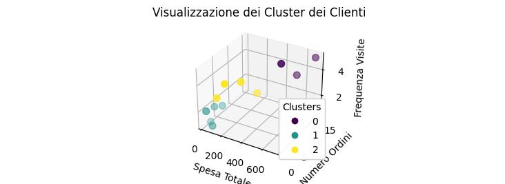

# Progetto di Clustering di Clienti

Questo progetto ha l'obiettivo di segmentare i clienti di un'azienda in gruppi (cluster) in base al loro comportamento d'acquisto. L'analisi di questi cluster può fornire informazioni preziose per strategie di marketing mirate, personalizzazione dell'offerta e miglioramento della relazione con i clienti.

## Riepilogo delle Attività Svolte

* [X] Inizializzazione del repository Git locale.
* [X] Creazione del repository remoto su GitHub.
* [X] Connessione del repository locale a quello remoto.
* [X] Creazione del file `.gitignore`.
* [X] Primo push del progetto su GitHub.
* [X] Installazione della libreria Pandas.
* [X] Creazione dello script `crea_dataset_sintetico.py` per generare dati di esempio.
* [X] Esecuzione dello script `crea_dataset_sintetico.py` e creazione del file `data/clienti_sintetico.csv`.
* [X] Creazione dello script `carica_dati.py` per caricare il dataset CSV in un DataFrame Pandas.
* [X] Esecuzione dello script `carica_dati.py` e caricamento del dataset.
* [X] Creazione del file `README.md` per la documentazione del progetto.
* [X] Creazione dello script `pre_processa_dati.py` per standardizzare le feature.
* [X] Esecuzione dello script `pre_processa_dati.py` e standardizzazione delle feature.
* [X] Creazione dello script `clustering_kmeans.py` per implementare l'algoritmo k-means.
* [X] Esecuzione dello script `clustering_kmeans.py` e assegnazione dei cluster.
* [X] Creazione dello script `valuta_cluster.py` per calcolare il coefficiente di silhouette.
* [X] Esecuzione dello script `valuta_cluster.py` e calcolo del coefficiente di silhouette.
* [X] Creazione dello script `visualizza_cluster.py` per visualizzare i risultati del clustering.
* [X] Esecuzione dello script `visualizza_cluster.py` e visualizzazione dei cluster in 3D.

* [X] Creazione dello script `metodo_gomito.py` per determinare il numero ottimale di cluster.

* [X] Esecuzione dello script `metodo_gomito.py` e analisi del grafico del metodo del gomito (che suggerisce k=3).

## Task Attuali

* [ ] (Potenziale) Esplorazione di diversi numeri di cluster (k).
* [ ] (Potenziale) Utilizzo di altre metriche di valutazione del cluster.
* [ ] (Potenziale) Analisi delle caratteristiche dei cluster.

## Prossimi Passi

* (Potenziale) Approfondimento dell'analisi dei cluster identificati.
* (Potenziale) Integrazione dei risultati in strategie di business.

