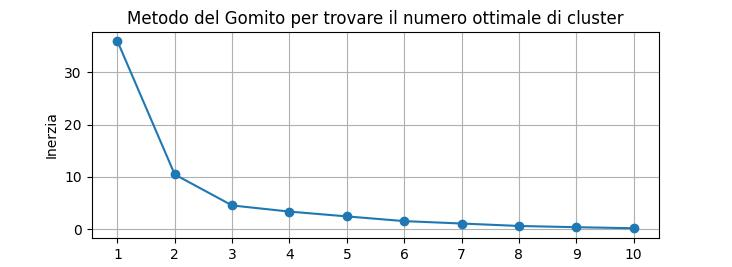

# Progetto di Clustering di Clienti

Questo progetto ha l'obiettivo di segmentare i clienti di un'azienda in gruppi (cluster) in base al loro comportamento d'acquisto. L'analisi di questi cluster può fornire informazioni preziose per strategie di marketing mirate, personalizzazione dell'offerta e miglioramento della relazione con i clienti.

## Riepilogo delle Attività Svolte

* [X] Inizializzazione del repository Git locale.
* [X] Creazione del repository remoto su GitHub.
* [X] Connessione del repository locale a quello remoto.
* [X] Creazione del file `.gitignore`.
* [X] Primo push del progetto su GitHub.
* [X] [Installazione della libreria Pandas](https://pandas.pydata.org/install/)
    <details>
        <summary>Istruzioni per l'installazione</summary>
        Per installare la libreria Pandas, esegui questo comando nel tuo terminale o prompt dei comandi:
        ```bash
        pip install pandas
        ```
    </details>
* [X] Creazione dello script `crea_dataset_sintetico.py` per generare dati sintetici di clienti.
* [X] Esecuzione dello script `crea_dataset_sintetico.py` e creazione del file `data/clienti_sintetico.csv`.
* [X] Creazione dello script `carica_dati.py` per caricare il dataset CSV in un DataFrame Pandas.
* [X] Esecuzione dello script `carica_dati.py` e caricamento del dataset.
* [X] Creazione del file `README.md` per la documentazione del progetto.
* [X] Creazione dello script `pre_processa_dati.py` per standardizzare le feature.
* [X] Esecuzione dello script `pre_processa_dati.py` e standardizzazione delle feature.
* [X] Creazione dello script `clustering_kmeans.py` per implementare l'algoritmo k-means. ([Introduzione al k-means](https://www.diariodiunanalista.it/posts/introduzione-al-clustering-non-supervisionato-con-k-means/) e [Cos'è il k-means?](https://www.ibm.com/it-it/think/topics/k-means-clustering)).
* [X] Esecuzione dello script `clustering_kmeans.py` e assegnazione dei cluster.
* [X] Creazione dello script `valuta_cluster.py` per calcolare il coefficiente di silhouette.
* [X] Esecuzione dello script `valuta_cluster.py` e calcolo del coefficiente di silhouette.
* [X] Creazione dello script `visualizza_cluster.py` per visualizzare i risultati del clustering in uno scatter plot 3D.
    
* [X] Esecuzione dello script `metodo_gomito.py` per determinare il numero ottimale di cluster.
    
* [X] Esecuzione dello script `metodo_gomito.py` e analisi del grafico del metodo del gomito (che suggerisce k=3).

## Struttura del Progetto

<details>
    <summary>Mostra la struttura del progetto</summary>
    ```
    clustering_clienti/
    ├── data/
    │   └── clienti_sintetico.csv
    ├── images/
    │   └── cluster_visualization_3d.jpeg
    │   └── metodo_gomito_grafico.jpeg
    ├── carica_dati.py
    ├── crea_dataset_sintetico.py
    ├── clustering_kmeans.py
    ├── metodo_gomito.py
    ├── pre_processa_dati.py
    ├── valuta_cluster.py
    ├── visualizza_cluster.py
    └── README.md
    ```
</details>

* `data/`: Contiene il dataset sintetico dei clienti in formato CSV.
* `images/`: Contiene le immagini dei grafici generati durante l'analisi.
* `*.py`: Script Python che implementano le diverse fasi del processo di clustering:
    * `carica_dati.py`: Carica il dataset.
    * `crea_dataset_sintetico.py`: Genera dati di esempio.
    * `clustering_kmeans.py`: Implementa l'algoritmo k-means.
    * `metodo_gomito.py`: Implementa il metodo del gomito per la scelta del numero di cluster.
    * `pre_processa_dati.py`: Standardizza le feature.
    * `valuta_cluster.py`: Calcola metriche di valutazione del cluster.
    * `visualizza_cluster.py`: Visualizza i risultati del clustering.
* `README.md`: Il file di documentazione principale del progetto.

## Task Attuali

* [ ] (Potenziale) Esplorazione di diversi numeri di cluster (k).
* [ ] (Potenziale) Utilizzo di altre metriche di valutazione del cluster (es. indice di Davies-Bouldin, coefficiente di Silhouette dettagliato).
* [ ] (Potenziale) Analisi delle caratteristiche dei cluster (es. calcolo delle medie delle feature per cluster).

## Prossimi Passi

* (Potenziale) Approfondimento dell'analisi dei cluster identificati per comprendere meglio i segmenti di clientela.
* (Potenziale) Integrazione dei risultati in strategie di business e raccomandazioni.

